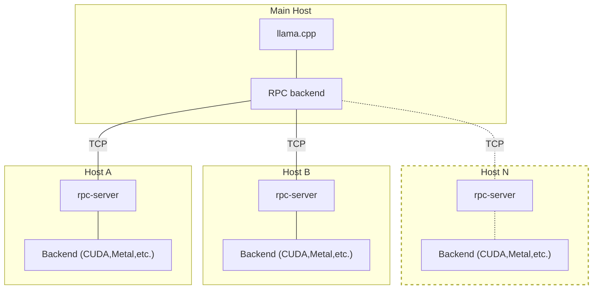

## 개요

`rpc-server`는 원격 호스트에서 `ggml` 백엔드를 실행할 수 있도록 합니다.
RPC 백엔드는 하나 이상의 `rpc-server` 인스턴스와 통신하고 계산을 넘겨줍니다.
이를 통해 다음과 같이 `llama.cpp`에서 분산 LLM 인퍼런스를 사용할 수 있습니다:



각 호스트는 다른 백엔드를 실행할 수 있습니다. 예를 들어, CUDA가 있는 호스트와 Metal이 있는 호스트가 있을 수 있습니다.
같은 호스트에서도 여러 개의 `rpc-server` 인스턴스를 실행하여 각각 다른 백엔드를 사용할 수 있습니다.

## 사용법

각 호스트에서 `cmake`를 사용하여 해당 백엔드를 빌드하고, 빌드 옵션에 `-DGGML_RPC=ON`을 추가합니다.
예를 들어, RPC 지원이 있는 CUDA 백엔드를 빌드하려면 다음과 같습니다:

```bash
mkdir build-rpc-cuda
cd build-rpc-cuda
cmake .. -DGGML_CUDA=ON -DGGML_RPC=ON
cmake --build . --config Release
```

그런 다음 백엔드와 함께 `rpc-server`를 시작합니다.

```bash
$ bin/rpc-server -p 50052
create_backend: using CUDA backend
ggml_cuda_init: GGML_CUDA_FORCE_MMQ:   no
ggml_cuda_init: CUDA_USE_TENSOR_CORES: yes
ggml_cuda_init: found 1 CUDA devices:
  Device 0: NVIDIA T1200 Laptop GPU, compute capability 7.5, VMM: yes
Starting RPC server on 0.0.0.0:50052
```

CUDA 백엔드를 사용할 때는 `CUDA_VISIBLE_DEVICES` 환경 변수로 장치를 지정할 수 있습니다. 예를 들어:
```bash
$ CUDA_VISIBLE_DEVICES=0 bin/rpc-server -p 50052
```
이렇게 하면 동일한 호스트에서 여러 개의 `rpc-server` 인스턴스를 실행할 수 있으며, 각 인스턴스는 다른 CUDA 장치를 사용할 수 있습니다.


메인 호스트에서 `llama.cpp`를 `-DGGML_RPC=ON`만 사용하여 빌드합니다:

```bash
mkdir build-rpc
cd build-rpc
cmake .. -DGGML_RPC=ON
cmake --build . --config Release
```

마지막으로, `--rpc` 옵션을 사용하여 각 `rpc-server`의 호스트 및 포트를 지정합니다:

```bash
$ bin/llama-cli -m ../models/tinyllama-1b/ggml-model-f16.gguf -p "Hello, my name is" --repeat-penalty 1.0 -n 64 --rpc 192.168.88.10:50052,192.168.88.11:50052 -ngl 99
```
